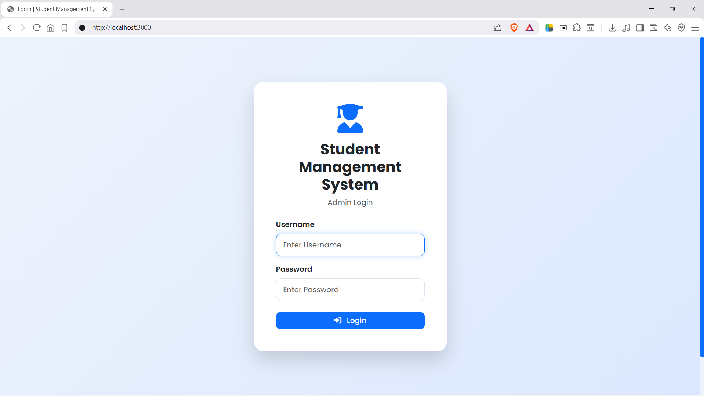
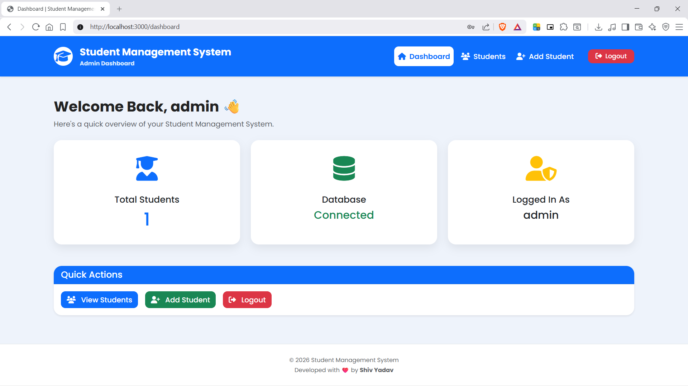
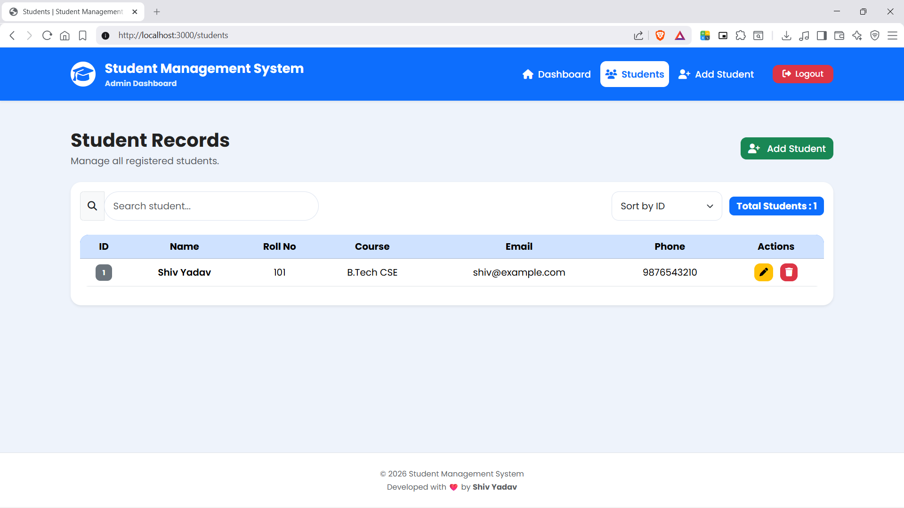
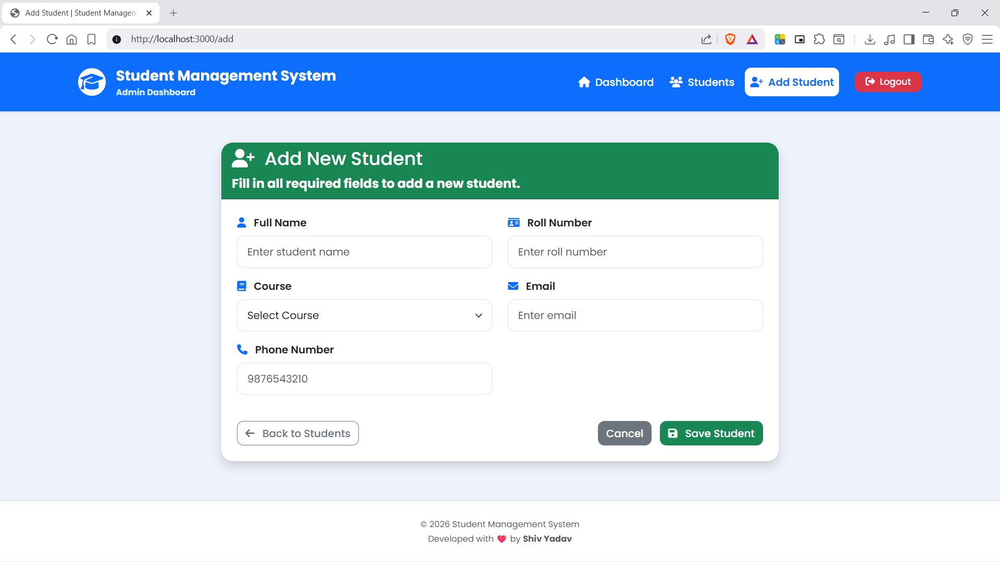
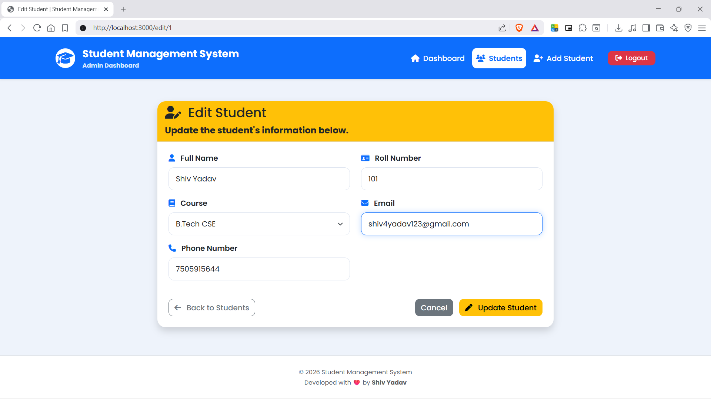

# 🎓 Student Management System


A full-stack **Student Management System** developed using **Node.js**, **Express.js**, **EJS**, **MySQL**, and **Bootstrap 5** following the **MVC Architecture**.

The application provides a secure admin portal for managing student records with authentication and complete CRUD functionality.

---

# 🚀 Features

- 🔐 Secure Admin Login (bcrypt)
- 🔑 Session-Based Authentication
- 📊 Dashboard
- ➕ Add Student
- 📄 View Students
- ✏️ Edit Student
- ❌ Delete Student
- 🔍 Search Students
- 🔃 Sort Students
- ⚠️ Flash Messages
- ✅ Input Validation
- 🚫 Duplicate Record Detection
- 📱 Responsive UI
- 🗄️ MySQL Database Integration
- 🚧 Custom 404 & 500 Error Pages

---

# 🖼️ Screenshots

## Login Page



---

## Dashboard



---

## Student List



---

## Add Student



---

## Edit Student



---

# 🏗️ Tech Stack

| Category | Technologies |
|----------|--------------|
| Frontend | HTML5, CSS3, JavaScript, Bootstrap 5, EJS |
| Backend | Node.js, Express.js |
| Database | MySQL |
| Authentication | Express Session, bcrypt |
| Environment | dotenv |
| Version Control | Git & GitHub |

---

# 📂 Project Structure

```text
Student-Management-System/

├── config/
│   └── db.js
│
├── controllers/
│   └── studentController.js
│
├── middleware/
│   └── auth.js
│
├── models/
│   ├── adminModel.js
│   └── studentModel.js
│
├── public/
│   ├── css/
│   └── js/
│
├── routes/
│   └── studentRoutes.js
│
├── screenshots/
│   ├── login.png
│   ├── dashboard.png
│   ├── students.png
│   ├── add-student.png
│   └── edit-student.png
│
├── views/
│
├── app.js
├── database.sql
├── package.json
└── README.md
```

---

# 🗄️ Database Schema

## students

| Column | Type |
|---------|------|
| id | INT |
| name | VARCHAR(100) |
| rollNo | VARCHAR(20) |
| course | VARCHAR(100) |
| email | VARCHAR(100) |
| phone | VARCHAR(15) |

## admins

| Column | Type |
|---------|------|
| id | INT |
| username | VARCHAR(50) |
| password | VARCHAR(255) |

---

# ⚙️ Installation

## Clone Repository

```bash
git clone https://github.com/shivsational/Student-Management-System.git
```

---

## Install Dependencies

```bash
npm install
```

---

## Configure Environment Variables

Create a `.env` file.

### Local MySQL

```env
DB_HOST=localhost
DB_USER=root
DB_PASSWORD=your_password
DB_NAME=student_management

SESSION_SECRET=your_secret
PORT=3000
```

---

## Import Database

Run:

```text
database.sql
```

---

## Start Application

Development

```bash
npm run dev
```

Production

```bash
npm start
```

---

Open:

```
http://localhost:3000
```

---

# 🔑 Default Admin Credentials

Username

```
admin
```

Password

```
admin123
```

---

# 📌 Future Enhancements

- Student Photo Upload
- Attendance Management
- Marks Management
- PDF Export
- Excel Export
- Email Notifications
- Multiple Admin Accounts
- Student Portal
- Pagination
- REST API
- Dashboard Analytics

---

# 👨‍💻 Author

**Shiv Yadav**

B.Tech Computer Science & Engineering

GLA University, Mathura

GitHub: https://github.com/shivsational

---

# 📜 License

This project is licensed under the ISC License.